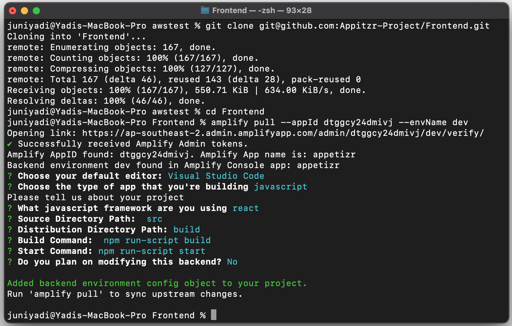

# Frontend

## 1. Setup AWS CLI dan AWS Amplify

Sebelum anda melakukan installasi, silahkan setting **aws cli** dan **aws amplify** terlebih dahulu, setting ini hanya pertama kali saja, selanjutnya tidak perlu melakukan setting ini.

Tutorial: https://github.com/base-pojokan/documentation/blob/main/aws-amplify.md

**Jika ini pertama kali anda melakukan setup, silahkan ikuti step 1, jika anda langsung ke step 2 tanpa melakukan step 1 untuk pertama kali, maka akan muncul error2 yang lainnya**

## 2. Development

**Jika anda muncul "Please choose the profile you want to use default", Pilih "AWS Profile" sama dengan Profile yang dibuat pada step 1.**

- Clone Repository

```
git clone git@github.com:Appitzr-Project/Frontend.git
```

- Pindah ke Folder Project

```
cd Frontend
```

- Pull data Backend AWS Amplify

```
amplify pull --appId dtggcy24dmivj --envName dev
```

- Amplify akan automatis membuka browser anda, dan diarahkan ke **Amplify Admin UI**, Silahkan gunakan sesuai dengan detail akun yang telah di invite.
- Kemudian setelah sukses login, isi data sebagai berikut :

```
$ amplify pull --appId dtggcy24dmivj --envName dev
Opening link: https://ap-southeast-2.admin.amplifyapp.com/admin/dtggcy24dmivj/dev/verify/
✔ Successfully received Amplify Admin tokens.
Amplify AppID found: dtggcy24dmivj. Amplify App name is: appetizr
Backend environment dev found in Amplify Console app: appetizr
? Choose your default editor: Visual Studio Code
? Choose the type of app that you're building javascript
Please tell us about your project
? What javascript framework are you using react
? Source Directory Path:  src
? Distribution Directory Path: build
? Build Command:  npm run-script build
? Start Command: npm run-script start
? Do you plan on modifying this backend? No

Added backend environment config object to your project.
Run 'amplify pull' to sync upstream changes.
```

- Screenshoot



- Setelah melakukan **amplify pull --appId dtggcy24dmivj --envName dev**, sekarang di folder **src** akan muncul file **aws-exports.js**